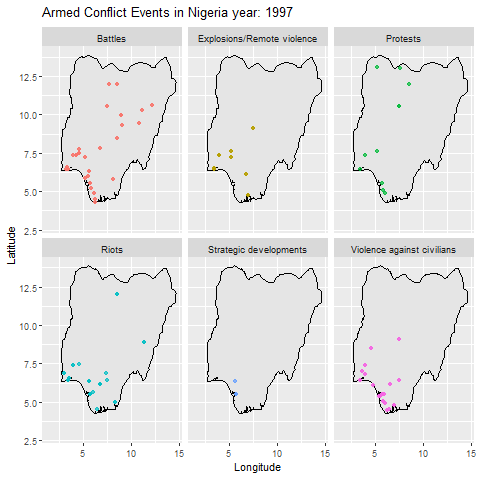

# 1 Single variables

## 1.1 Event Type - Sub Event Type

*Use wide data to make event unique*

-   **Proportion of event types**\
    *Visualization*: Pie chart

-   **Compare counts of sub event types**\
    *Visualization*: Stacked Bar Chart of types and sub types

## 1.2 About Actor

*Use long data to fully count actors*

-   **Detect most active actors: top 10 / top 20**\
    *Visualization*: Bar charts

-   **Note**: Top 5+ are civilians or official groups\
    To get insight of rebellious armed group, use filter\
    *Visualization*: Bar charts (top 10, using color to represent if Nigeria)

-   **Categorization**:\
    With 439 different actors it becomes overwhelming\
    Categorize actors into 7 groups according to international code (doc from ACLED)\
    *Incomplete, need to be validated*

-   **Compare counts of categories**\
    Run 2 versions: with/without categorized\
    *Visualization*: Bar chart

# 2 Time Series Analysis

## 2.1 Series Analysis of Event Type

*Use wide data to make event unique*\
*Note: Filter out the value of 2025 as it represents incomplete statistics.*

-   **Trend of total number of events**\
    *Visualization*: Line chart (year vs. count of event type (sum))

-   **Trend of each type of event**\
    *Visualization*: Line chart (year vs. count of each event type, grouped by event type; colored by different event types)

-   **Seasonal periodicity of total events**\
    *Visualization*: Line chart (month vs. count of event type (sum))

-   **Seasonal periodicity of each type of event**\
    *Visualization*: Line chart (month vs. count of each event type, grouped by event type; colored by different event types)

## 2.2 Series Analysis of Actor

*Use long data to fully count actors*\
*Use the categorized actor data*

-   **Trend of events caused by top 10 actors**\
    *Visualization*: Line chart (year vs. count of events, grouped by actor; colored by different actor)

-   **Seasonal periodicity of events caused by top 10 actors**\
    *Visualization*: Line chart (month vs. count of events, grouped by actor; colored by different actor)

-   **Trend of events caused by actor category**\
    *Visualization*: Line chart (year vs. count of events, grouped by actor category; colored by different actor category)

-   **Seasonal periodicity of events caused by actor category**\
    *Visualization*: Line chart (month vs. count of events, grouped by actor category; colored by different actor category)

# 3 Geographical Distributions

*Get map data for Nigeria*\
*Consider using terrain data (e.g., contour lines). One option is using Google maps via `ggmap()`, though an API key is required.*

## 3.1 Overview of Distribution

*Use wide data to make event unique*

-   **Distribution of total events**\
    *Visualization*: Map plot with all event points (transparency set to alpha = 0.1)

-   **Alternative**: Geological heat map (bins)

## 3.2 Distribution of Event Type

*Use wide data to make event unique*

-   **Distribution of each type of event**\
    *Visualization*: Faceted map plots (each subplot for one event type, grouped and colored by event type)

## 3.3 Distribution of Actors

*Use long data to fully count actors*\
*Use the categorized actor data*

-   **Distribution of each top 10 actor**\
    *Visualization*: Faceted map plots (each subplot for one actor, grouped and colored by actor)

-   **Distribution of each actor category**\
    *Visualization*: Faceted map plots (each subplot for one actor category, grouped and colored by actor category)

# 4 Association Analysis

## 4.1 Casualty Analysis

*Use wide data to make event unique*

-   **Analysis of fatalities per event type**\
    Study average/median/sum of fatalities\
    *Note*: Which key value is best?\
    *Visualization*: Bar chart

-   **Alternative approach**:\
    Study event type and sub event type (resulting in a stacked bar chart)

-   **Further alternative**:\
    Study based on population influenced

## 4.2 Event Types vs Actor Categories

-   **Statistical Tests**:\
    Chi-Square Test\
    Cramer's V Coefficient

## 4.3 Time vs Geography

*Analysis details to be added*

# 5 Advanced Analysis

*Details to be added*
