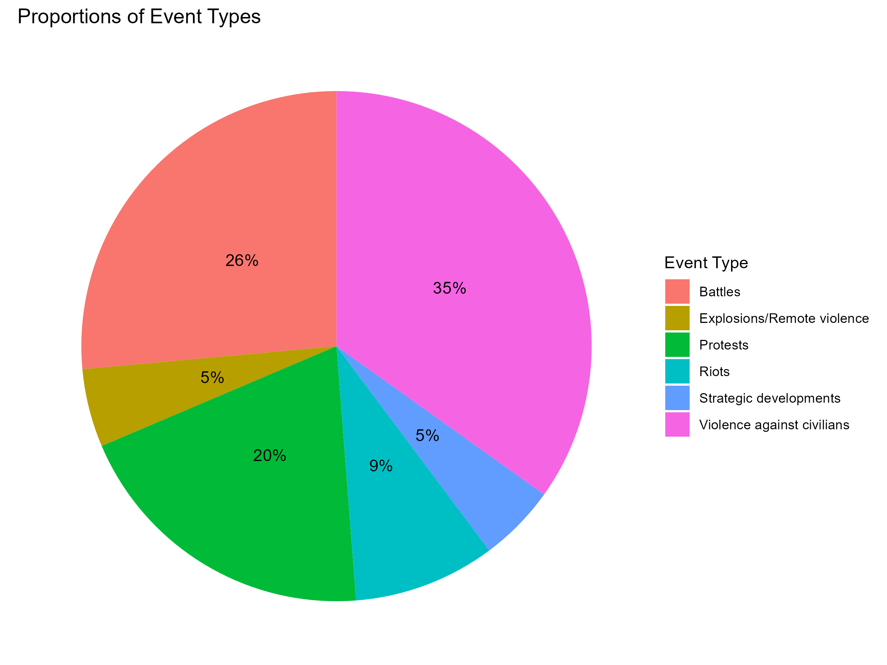
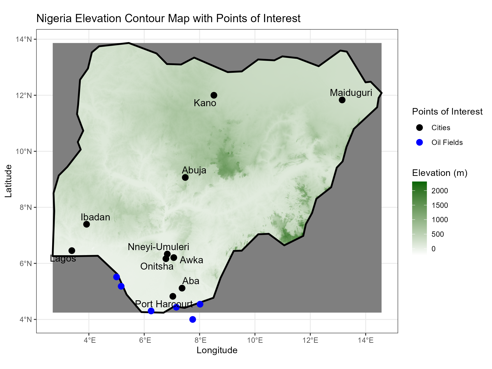
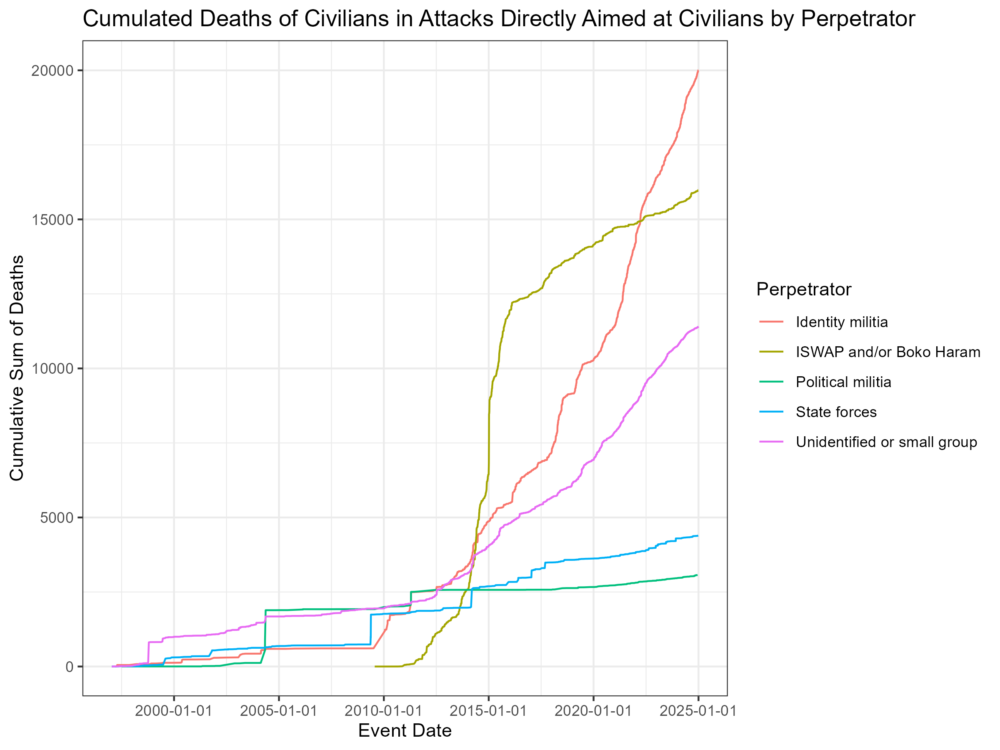
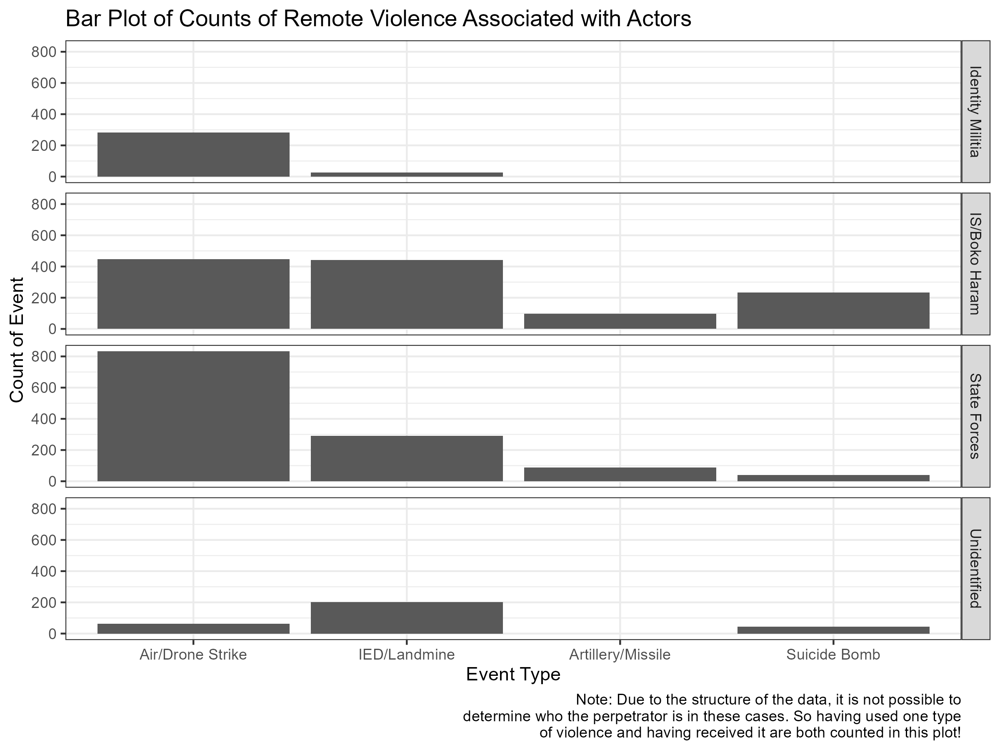
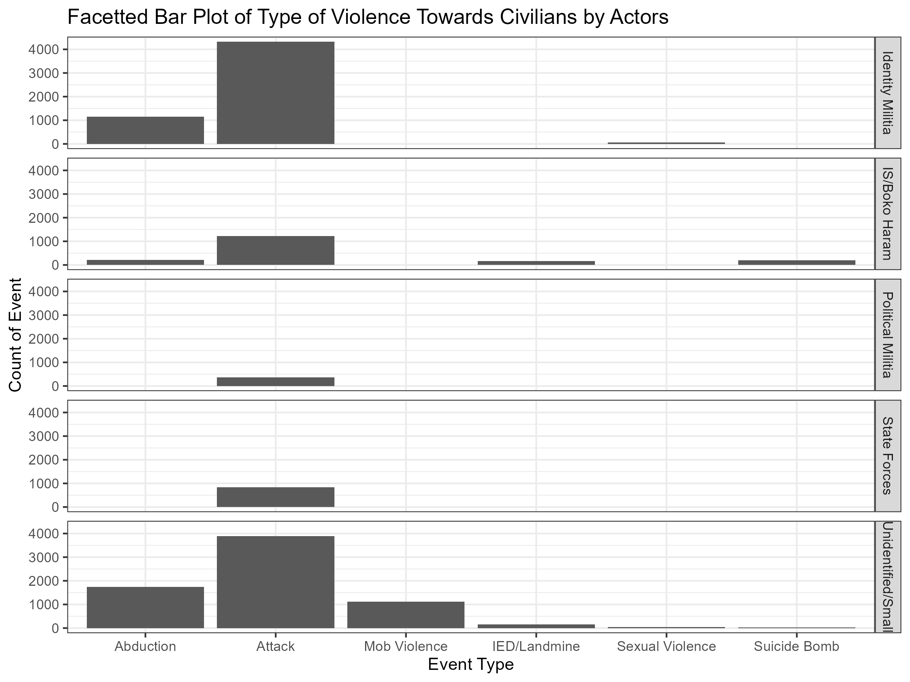
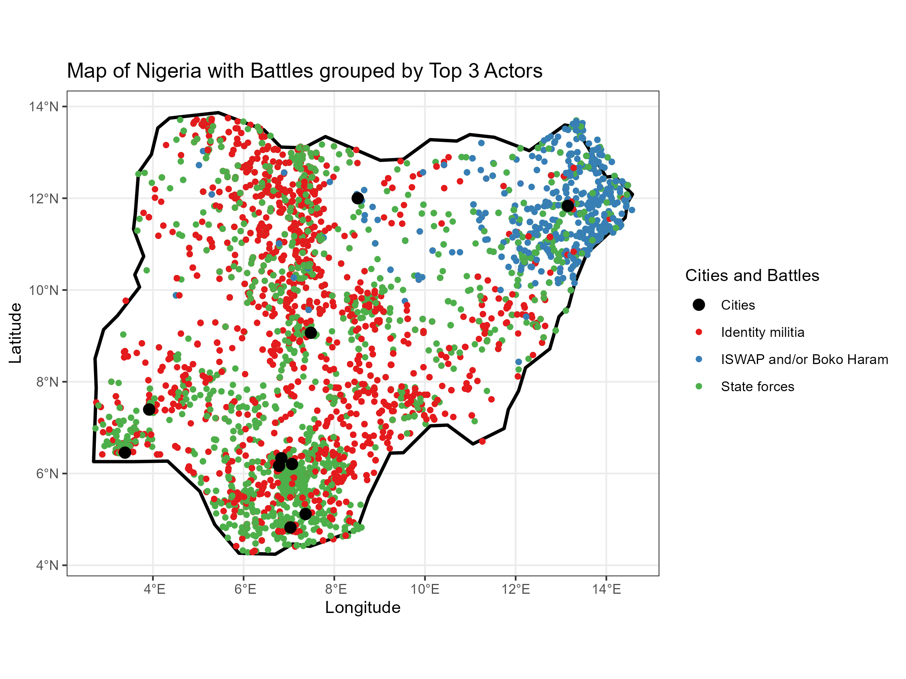
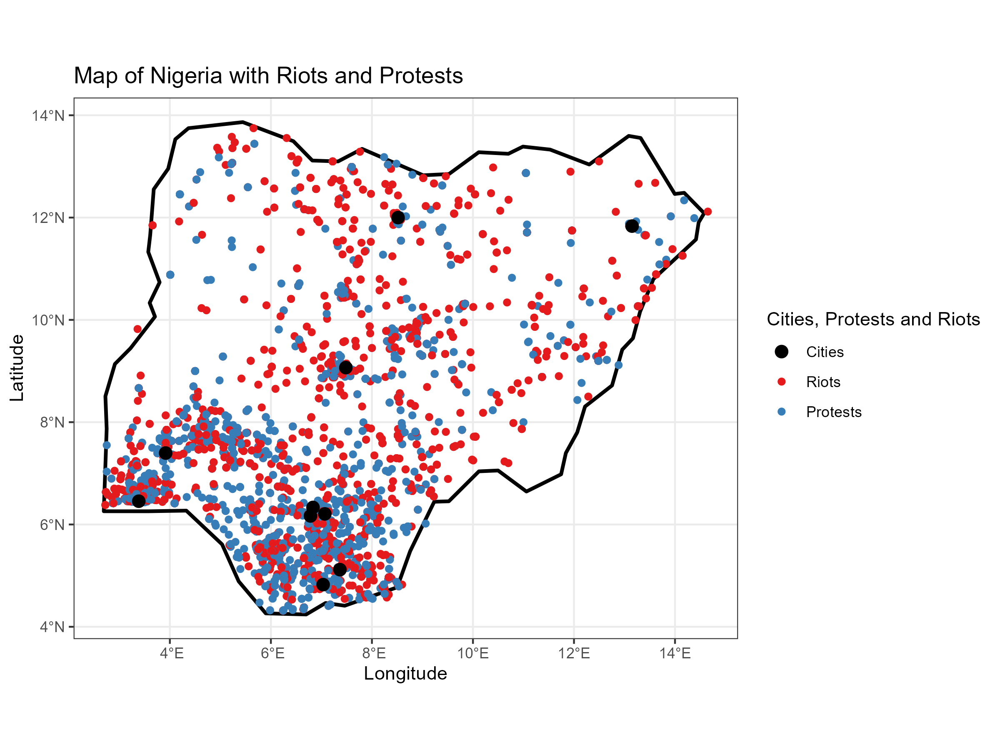
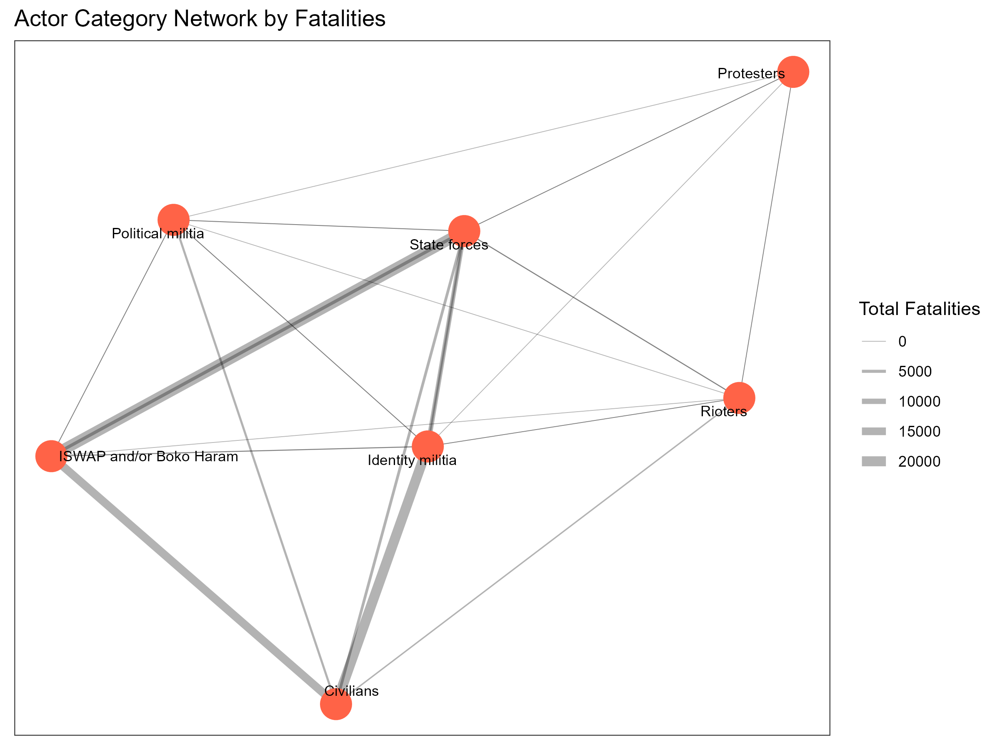

# Plots for Presentation with some Meta Commentary

First, let's assess the general situation. What kind of conflicts exist in Nigeria? How is the country structured geographically?

The kinds of conflicts seem to be heterogeneous. There are battles and what one could consider terrorism (explosions, violence towards civilians) but also protests and riots. What can we say about actors? Who is especially active and who is especially brutal/dangerous to civilians?

Identity militias, ISWAP/Boko Haram and the state forces are associated with the most fatalities and could therefore be considered the most active groups. Unidentified groups have a bigger share in civilian deaths than one would expect when looking at their total associated deaths. This group might include criminals. Also ISWAP/Boko Haram and identity militias are associated with a lot more civilian casualties than the state forces, despite being similar in terms of total fatalities. Do the groups differ in their means of violence?

Drone and airstrikes seem to have a higher association with the state forces. IED/landmine association seems to be low with identity militias. Artillery and missile attacks only occurred with state forces and the ISWAP/Boko Haram. Suicide bombing has high association with ISWAP/Boko Haram.

Abduction is highly associated with unidentifieds and identity militias, but also occurred with ISWAP/Boko Haram. Attacks were the most prevalent sub events in general. Mob violence only occured with small and unidentified groups. Civilian deaths due to landmines were attributed to ISWAP/Boko Haram and unidentified and small groups. Sexual violence occured with identity militias and unidentified and small groups. Civilian suicide bombing occured with ISWAP/Boko Haram und unidentified and small groups.

How are the events spread out geographically?

Identity militias seem to have fought in central and south Nigeria. Battles between state forces and ISWAP/Boko Haram seem to have happened in the North East. ISWAP/Boko Haram and identity militias seem to have fought less often.

Riots and protests seem to be more prevalent in southern Nigeria.

Is event intensity time-dependent?

Battles in the northeast seem to have been intensifying since approximately 2013. Battles in central and south Nigeria seem to have been intensifying since approximately 2017.

Larger amounts of protests in the south seem to be happening since the end of 2013. Moderate amounts of protests in the north seem to be happening since approximately 2017.

Can we find information about the conflict groups´ relations?

The edges in this network graph relate to the total deaths in associated conflicts. The strongest edges are between: 

-ISWAP/Boko Haram and state forces 

-ISWAP/Boko Haram and civilians 

-Civilians and identity militias 

-(a bit weaker) identity militias and state forces

One should note that there is a weak edge between ISWAP/Boko Haram and identity militias. All other edges are moderate to weak, which still means 3 to 4 digit death tolls.
