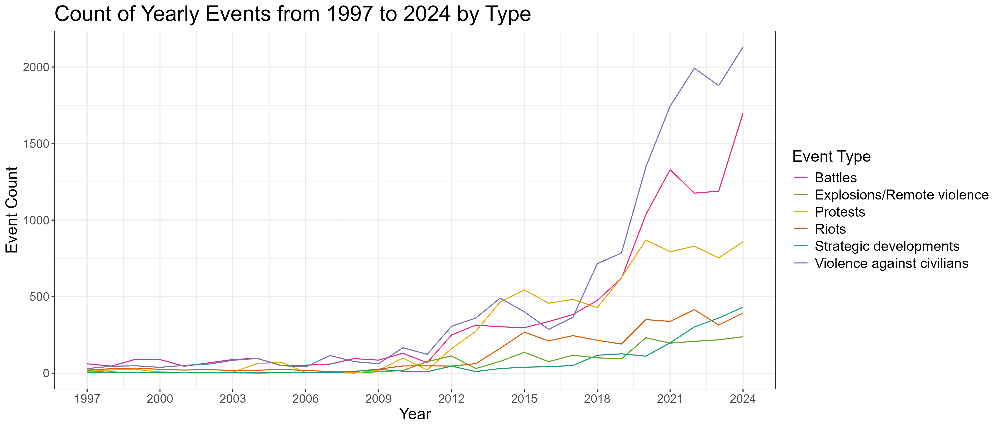
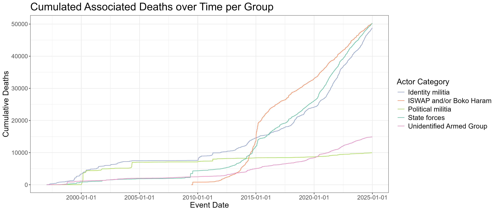
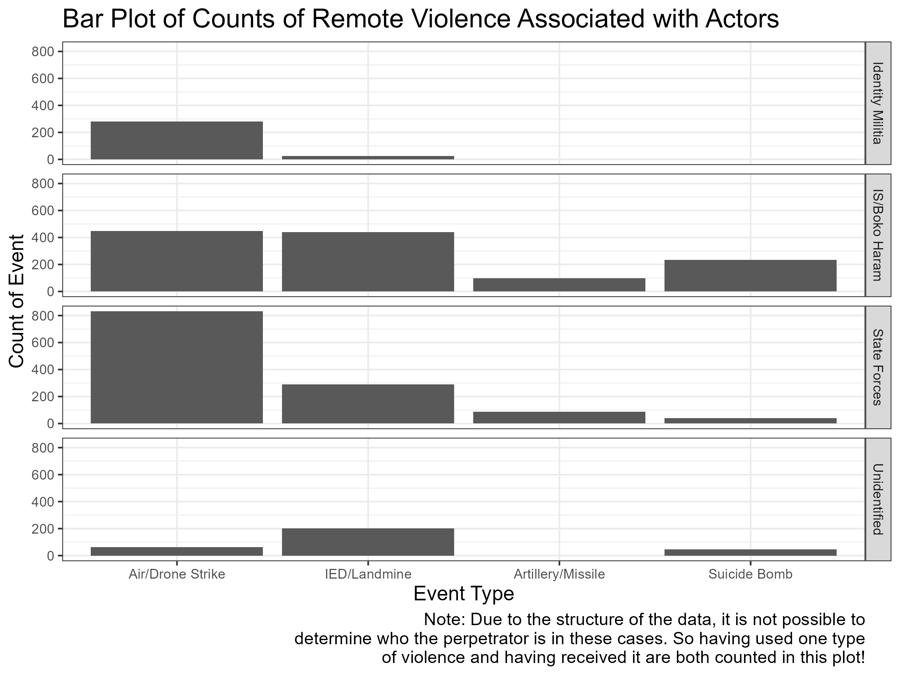
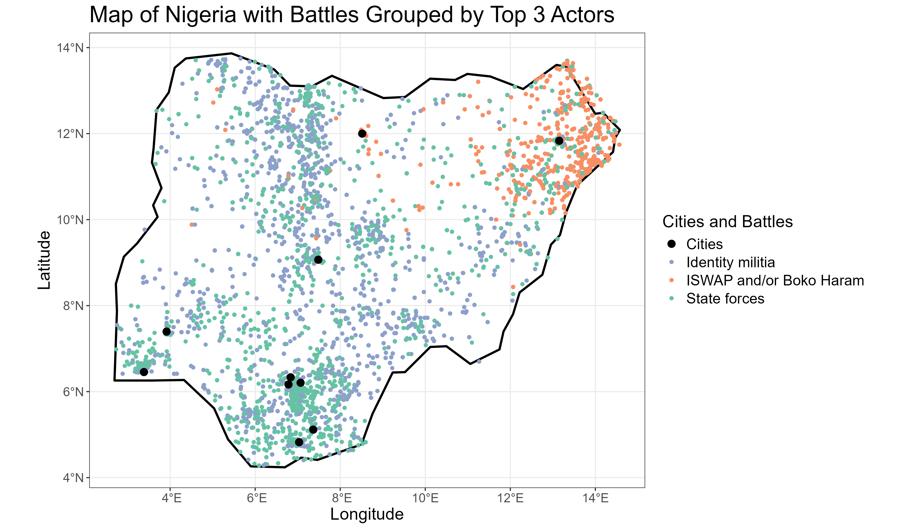
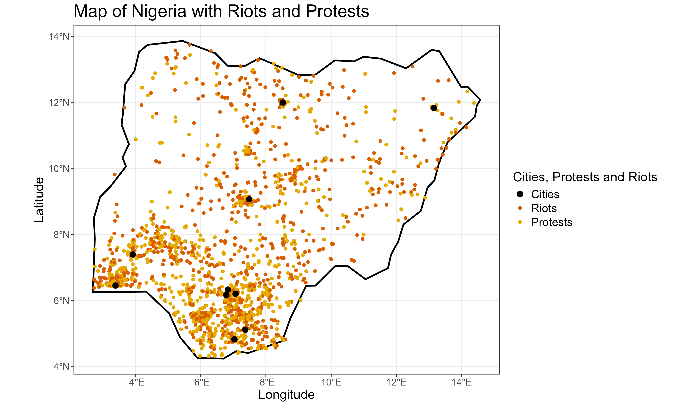
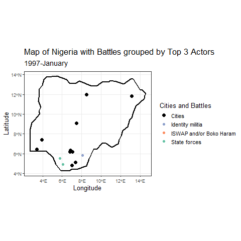
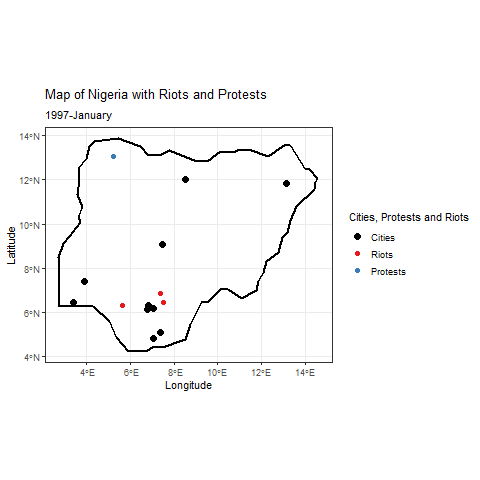

```{r setup, include=FALSE}
source("source_all.R")

```

## Agenda

::: incremental
1.  Introduction: Nigeria

2.  Data Structure and Method

3.  Plots and Data Analysis

    3.1. Getting to Know the Events\
    3.2. Getting to Know the Actors\
    3.3. Connection between Actors and Events\
    3.4. Further Connections

4.  Summary
:::

## 1. Introduction: Nigeria


## 1. Introduction: Nigeria

::: incremental
-   Nigeria has had a troubled past in the 20th century:
-   Formerly under british colonial rule
-   Self ruled since 1954 and independet since 1960
-   Heterogeneous resource and ethnical distribution throughout the country
-   Civil War from 1967 to 1970 as state of Biafra tried to gain independence
:::

## 2. Data Structure and Method

::: incremental
-   Data is sourced from ACLED
-   Observation dates range from 1997 to 2025
-   70897 observations with 39813 unique event IDs
-   Undirected network data
-   Vast variety in variables like actors and subevents
-   **Main challenges in data analysis are simplification and dealing with undirectedness**
:::

## 2. Data Structure and Method

::: incremental
-   **Method**
-   Analysis is purely descriptive
-   Variety of plotting styles was used including facetting, plotting over maps and animation

------------------------------------------------------------------------

-   **Proposed Research Questions**
-   Is there an association between type of conflict and conflict groups ?
-   Is there a change in the type of conflict observable over time ?
:::

## 3. Plots and Data Analysis

## 3.1. Getting to Know the Events (1/2)

### Most General Question: What Types of Events are there ?


## 3.1. Getting to Know the Events (2/2)

### Did the Types of Events Change over Time ?



## 3.2. Getting to Know the Actors (1/2)

### How can we Group Actors and which Ones are Most Impactful ?



## 3.2. Getting to Know the Actors (2/2)

### Which Actors are most Hurtful to Civilians ?


## 3.3. Association between Actors and Events (1/2)

### Do the Actors Differ in their Means of Civilian Violence ?


## 3.3. Association between Actors and Events (2/2)

### Do the Actors Differ in their Means of Remote Violence Towards other Armed Groups?



## 3.4. Further Connections (1/5)

### Are there Geographic Patterns?: Battles



## 3.4. Further Connections (2/5)

### Are there Geographic Patterns?: Riots and Protests



## 3.4. Further Connections (3/5)

### How did Battles Develop over Time?



## 3.4. Further Connections (4/5)

### How did Protests and Riots Develop over Time?



## 3.4. Further Connections (5/5)

### Important Question: Can We Make out Adversaries from the Data?


