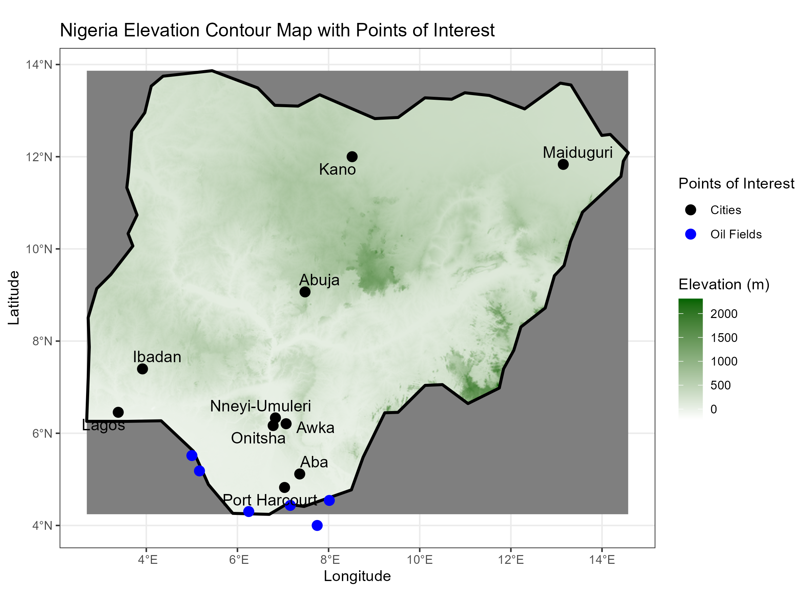

```{r setup, include=FALSE}
source("source_all.R")

```

## Agenda

::: incremental
1.  Introduction: Nigeria

2.  Data Structure and Method

3.  Plots and Data Analysis

    3.1. Getting to Know the Events\
    3.2. Getting to Know the Actors\
    3.3. Connection between Actors and Events\
    3.4. Further Connections

4.  Summary
:::

## 1. Introduction: Nigeria (1/2)



## 1. Introduction: Nigeria (2/2)

::: incremental
-   Nigeria has had a troubled past in the 20th century:
-   Formerly under british colonial rule
-   Self ruled since 1954 and independet since 1960
-   Heterogeneous resource and ethnical distribution throughout the country
-   Civil War from 1967 to 1970 as state of Biafra tried to gain independence
:::

## 2. Data Structure and Method (1/2)

::: incremental
-   Data is sourced from ACLED
-   Observation dates range from 1997 to 2025
-   70897 observations with 39813 unique event IDs
-   Undirected network data
-   Vast variety in variables like actors and subevents
-   **Main challenges in data analysis are simplification and dealing with undirectedness**
:::

## 3. Data Structure and Method (2/2)